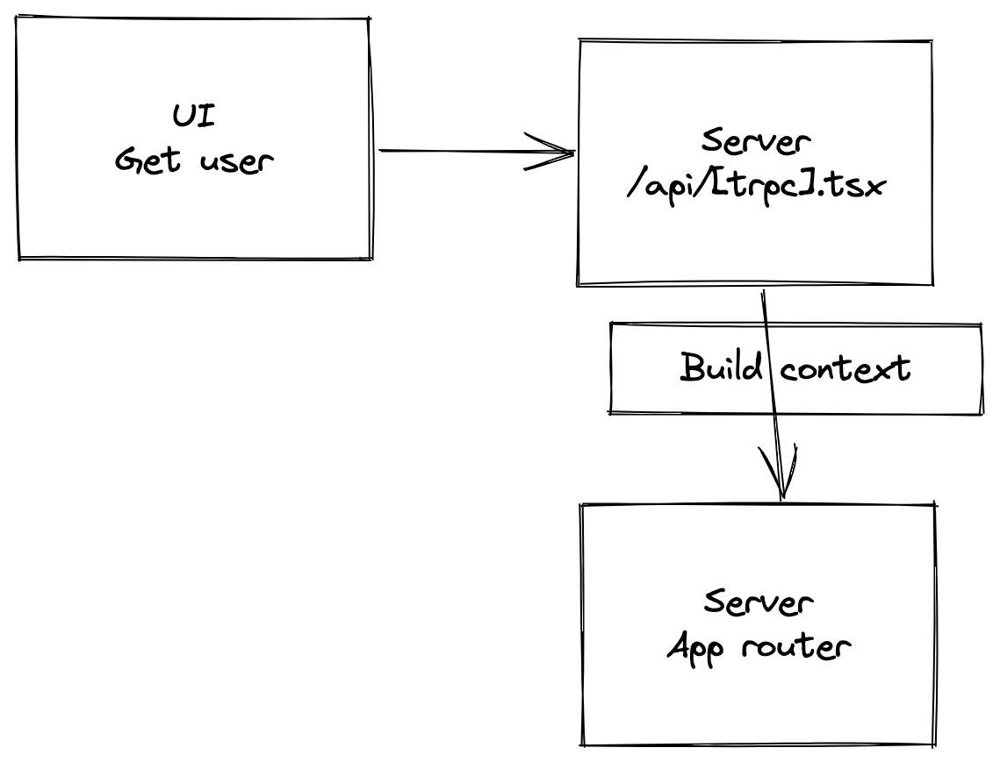

# tRPC with Next.js, TypeScript & Prisma

## Why you should be learning & using tRPC
* Making E2E type-safe APIs is fun and easy
* Gives you a deeper understanding of Next.js 
* Going to be very popular (prediction)

## Technologies used
* tRPC
* TypeScript
* Prisma (Postgres)
* Zod - Schema validation & type generation
* nodemailer - Sending OTP emails

## Features
* Register user
* Login with OTP
* Create a post
* View a post
* List posts

 

## Bootstrap application
`npx create-next-app@latest --ts`

## Install dependencies
`npm install @trpc/client @trpc/server @trpc/react @trpc/next zod react-query superjson jotai @prisma/client react-hook-form jsonwebtoken cookie nodemailer`

`npm install @types/jsonwebtoken @types/cookie @types/nodemailer -D`

## Prisma
`npx prisma init`

`npx prisma migrate dev --name NAME_HERE`

 

or `npx create-t3-app@latest` check: https://github.com/t3-oss/create-t3-app